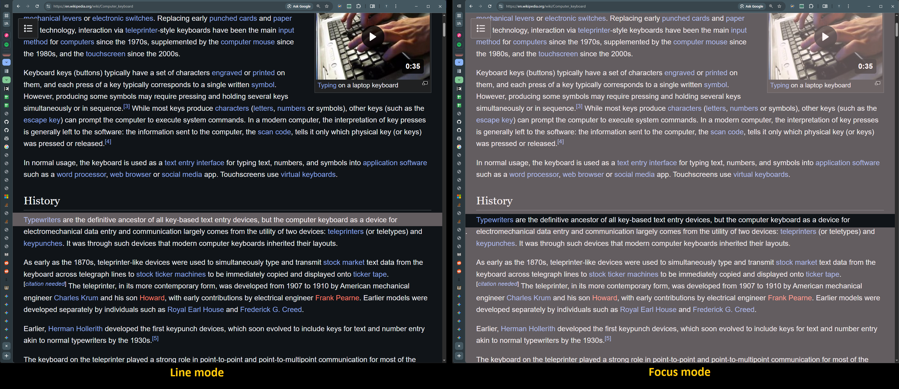

# Reader Line

> **Fork & Credits:** This repository is a personal fork of https://github.com/kamilrizatdinov/reader_line — React, localization, and the build pipeline were removed to shrink it for private use. All credit to the original author (original repo has no license).

A lightweight Chrome extension (Manifest V3) that overlays a customizable, mouse-tracking reading guide on web pages.

## Features

- **Customizable guide**: color, opacity, height
- **Two modes**: line (simple bar) or focus (spotlight effect)
- **Keyboard shortcuts**: `[` / `]` to adjust height by 2px
- **Zero setup**: vanilla JS + native storage, no external libraries or build steps

## Quick Start

1. Load `public/` as an unpacked extension in Chrome
2. Click the extension icon to open the popup
3. Adjust color, opacity, height, and mode to your preference
4. Move the guide with your mouse; use `[` / `]` to resize (when enabled)

## Project Architecture

**Shared layer**: `StorageService` abstracts `chrome.storage.local`; `CONSTANTS` define keys

**Content script**: `ReaderLine` class manages DOM + styles; `CommandRegistry` handles keyboard shortcuts

**Popup**: `PopupController` handles UI binding and persistence

**Background**: Injects content script into tabs

See [AGENTS.md](AGENTS.md) for codebase overview.

---
**Attribution:** Fork of [kamilrizatdinov/reader_line](https://github.com/kamilrizatdinov/reader_line/) — all credit to the original author.
